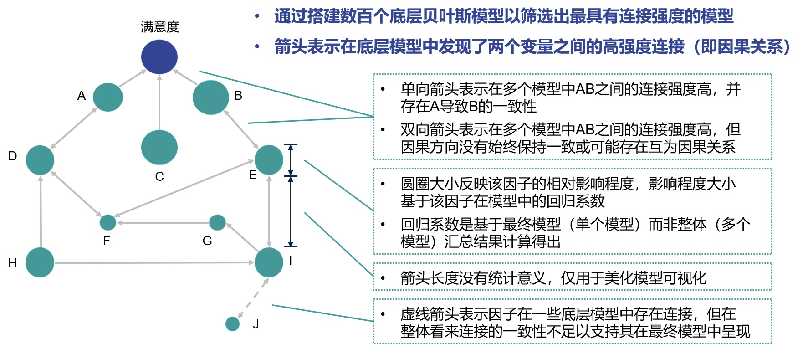

# 基于Bootstrap贝叶斯网络的品牌驱动因素可视化分析
### 1.项目在做什么？
在进行品牌ATU(Awareness Trial Usage) Tracking项目时，会收集调研品牌和竞品的品牌驱动因素a.评分，b.重要性评分，c.总体满意度评分，基于Bootstrap贝叶斯网络，可以量化各个驱动因素间的关联强度，以及其对总体满意度的贡献程度，帮助品牌做到更好的产品定位，提高医生满意度，进而提升处方率。
### 2.模型原理
#### （1）贝叶斯网络模型
贝叶斯概率图模型是一种用于建模随机变量之间关系的工具。它结合了概率论和图论的方法，用图来表示变量之间的依赖关系，并使用概率分布来描述这些变量之间的关联。贝叶斯概率图模型通常分为两类：贝叶斯网络（Bayesian Networks）和马尔可夫随机场（Markov
Random FieldsFields）。概率图模型的学习，分为结构学习和参数学习，这里只用到结构学习，构建品牌驱动因素和总体满意度间的关联网络。
   
#### （2）Bootstrap抽样
Bootstrap抽样是一种统计重采样技术，核心思想是通过从原始数据集中进行有放回的重复抽样，来模拟数据的生成过程。适用于：
- 样本量较小的情况
- 统计量分布复杂或未知的情况

在这里引入Bootstrap抽样的原因：由医疗问卷得到的品牌评分数据样本量小（n<1000）,分布未知，直接将所有数据用于贝叶斯网络的结构学习，生成的结构不稳定，解释性差。使用Bootstrap抽样后，可以根据抽样数据构建数百个网络，汇总关系矩阵，百分化为关系强度，输出结果稳定，更易解释。
### 3.数据预处理
#### （1）数据准备（示例数据见bayesian_sample.xlsx）
- 品牌驱动因素医生评分数据

| | brandA-feature1 |brandA-feature2|brand A-feature3|brandB-feature1|brandB-feature2| brand B-feature3  |
|----|----|----|----|----|----|-------------------|
|医生1|评分|评分|评分|评分|评分|评分|
|医生2|评分|评分|评分|评分|评分|评分|

- 品牌驱动因素重要性评分数据（无关品牌）

| | feature1 |feature2|feature3|
|----|-----------------|----|----|
|医生1|评分|评分|评分|
|医生2|评分|评分|评分|

- 品牌总体评分数据（无关驱动因素）

| | brandA-总体满意度 | brandB-总体满意度 |
|----|--------------|--------------|
|医生1| 评分           | 评分           |
|医生2| 评分           | 评分           |

#### （2）数据重排
- 列为驱动因素，行为医生针对每个品牌的评分

|            | feature1 |feature2|feature3|总体满意度 |
|------------|-----------------|----|----|----|
| 医生1-brandA |评分|评分|评分|评分|
| 医生1-brandB |评分|评分|评分|评分|
| 医生2-brandA |评分|评分|评分|评分|
| 医生2-brandB |评分|评分|评分|评分|

- 根据重要性评分对每个医生每个品牌的评分进行重要性加权

以上为数据准备部分，预处理后的示例数据见bayesian_sample.xlsx。说明：数据已对品牌和医生脱敏，保留驱动因素方便可视化展示。
### 4.模型实现（见sample_bnlearn.py）
#### （1）导入python相关库
关键库：sklearn用于数据离散化，bnlearn用于贝叶斯结构学习，pyvis用于初期可视化

其他支持库：numpy pandas sklearn matplotlib
#### （2）数据离散化
由于贝叶斯网络结构学习只接受离散数据，需要对重要性加权后的连续数据进行分类，可以采用quantile或者聚类，经验分类数量为3-4类。
#### （3）Bootstrap抽样+贝叶斯网络实现
抽样,对每次抽样构建贝叶斯，计算adjmat，储存写入h5;汇总关系矩阵（有向、无向），储存写入excel

Bootstrap经验抽样次数为200次，抽样比例为90%，结构学习的方法为hc（具体参见[BNLearn’s Documentation](https://erdogant.github.io/bnlearn/pages/html/index.html)）
#### （4）可视化（见sample_fig.html）
根据汇总关系矩阵，指定可视化的阈值（例如：80%，100次抽样中80次A驱动因素和B驱动因素间有连接关系，则在可视化中显示）；

pyvis只用于初期可视化探索，在报告展示中，需要明确关系矩阵的具体细节。
#### （5）*回归分析
贝叶斯网络结构学习部分只能用于关系网络的创建，驱动因素对总体满意度的贡献程度可以用回归分析的结果，在可视化中予以体现。
### 5.结果解读
 
